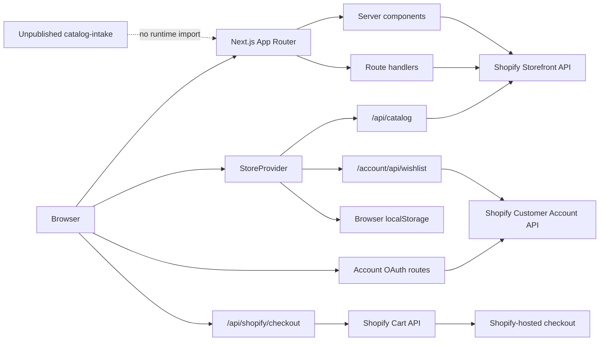
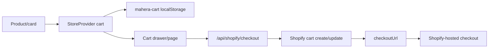

# House of Aristocrat

House of Aristocrat is a custom headless Shopify ecommerce storefront for premium Indo-Western fashion. The application uses Next.js for the storefront and server endpoints while Shopify remains the source of truth for catalog data, customer identity, carts, and hosted checkout.

## Current status

This is a production-oriented headless Shopify build. The homepage is frozen at its current 9/10 design unless a real bug or explicit client change requires work. Support/legal routes and a full-site QA pass are complete. A separate, unpublished intake maps 27 new CSV products and image-only candidates. Launch still depends on live Shopify/payment/shipping configuration, a final domain, merchant acceptance testing, and client approval of catalogue and policy details. Repository code cannot confirm Shopify Admin or payment activation state.

## Documentation map

- [App Router and routes](app/README.md)
- [Component architecture](components/README.md)
- [Global storefront state](context/README.md)
- [Shared domain logic](lib/README.md)
- [Shopify integration](lib/shopify/README.md)
- [Catalog model](lib/catalog/README.md)
- [Homepage](components/home/README.md)
- [Collections](components/collection/README.md)
- [Products](components/product/README.md)
- [Cart and checkout UI](components/cart/README.md)
- [Customer account UI](components/account/README.md)
- [Layout](components/layout/README.md)
- [UI primitives](components/ui/README.md)
- [Reusable hooks](hooks/README.md)
- [Unpublished product intake](catalog-intake/README.md)
- [Diagnostic and validation scripts](scripts/README.md)

## Tech stack

| Technology | Repository version/use |
| --- | --- |
| Next.js | `15.5.22`, App Router, server components, route handlers, metadata routes |
| React | `19.0.0` |
| TypeScript | `5.7.x`, strict mode, no emit |
| Shopify Storefront API | GraphQL catalog, products, collections, markets, cart, and checkout; API version `2026-07` |
| Shopify Customer Account API | OAuth/OpenID with PKCE, customer summary, and customer wishlist metafield |
| Framer Motion | Component entrance, drawer, card, and interaction motion |
| GSAP | Ticker integration for Lenis; ScrollTrigger is not currently registered |
| Lenis | Desktop/fine-pointer smooth scrolling; disabled for reduced motion and coarse/mobile pointers |
| React Hook Form and Zod | Present in the local address editor component, which is not wired to the active account routes |
| CSS | The active styling system; most styles live in `app/globals.css`, with CSS Modules for selected UI controls |
| Tailwind CSS | Installed as a development dependency but not configured or meaningfully used |
| shadcn/ui | Not installed or used |
| Vercel | Intended deployment platform; no tracked `vercel.json` or CI workflow |

## Architecture overview



The root server layout installs two client boundaries: `SmoothScrollProvider` and `StoreProvider`. Server components fetch initial product/account data directly through `lib/`; interactive components use the internal catalog, checkout, and wishlist route handlers.

## Folder structure

```text
app/                  App Router pages, loading/error UI, API and metadata routes
components/           Feature and shared React components
context/              Browser storefront state and persistence
files/                Local campaign/product assets served by internal asset routes
hooks/                Hook-level utilities; currently small
lib/                  Catalog, Shopify, account and motion domain logic
scripts/              Manual Shopify connection/catalog diagnostics
catalog-intake/       Unpublished 27-product intake, image candidates, client template
public/               Local fonts; application icons live in app/
services/             Small service wrappers; newsletter service is not wired end-to-end
types/                Shared account, checkout and commerce types
animations/           Supporting animation assets/code; not a primary runtime boundary
features/             Legacy/supporting feature documentation or code
shopify/              Repository Shopify supporting material; runtime integration lives in `lib/shopify`
styles/               Supporting styles; the active global stylesheet is `app/globals.css`
```

Do not assume every tracked component is active. See the feature READMEs for current entry points and known dormant files.

## Local development setup

The repository uses npm (`package-lock.json`). It does not pin Node through `engines`, `.nvmrc`, or `.node-version`; use a Node.js version supported by Next.js 15 and record a team-wide version before production.

```bash
npm ci
Copy-Item .env.example .env.local  # PowerShell
npm run dev
```

Open `http://localhost:3000`. The development server writes to `.next-dev`; production builds write to `.next`.

Verification commands:

```bash
npm run lint
npm run build
node scripts/validate-product-intake.mjs
node --test scripts/validate-product-intake.test.mjs
npm run test:shopify
npm run audit:shopify
```

The two Shopify scripts read `.env.local` and contact Shopify; they require credentials and are diagnostics. The intake validator and Node tests run locally without Shopify. A restricted shell may need permission to spawn the Node test worker.

## Environment variables

No `NEXT_PUBLIC_*` variables are used. Keep the current server-side boundary even for values that are public by protocol. The local availability column records only presence at this audit; another machine or deployment may differ. No values are shown.

| Variable | Requirement and purpose | Boundary | Current local state |
| --- | --- | --- | --- |
| `SHOPIFY_STORE_DOMAIN` | Required for live Storefront and Customer Account discovery | Server configuration | Missing |
| `SHOPIFY_STOREFRONT_ACCESS_TOKEN` | Required for Storefront GraphQL/cart | Server only | Missing |
| `SHOPIFY_CUSTOMER_ACCOUNT_CLIENT_ID` | Required for custom account OAuth/wishlist; public by protocol | Read server-side in this app | Set |
| `SHOPIFY_CUSTOMER_ACCOUNT_URL` | Optional hosted-account destination for orders, addresses, profile and fallback | Server-resolved URL | Missing |
| `ENABLE_LOCAL_CATALOG_FALLBACK` | Optional, development-only sold-out preview | Server configuration | Missing |
| `NEWSLETTER_SUBSCRIBE_WEBHOOK_URL` | Optional provider endpoint; absent makes footer subscription unavailable | Server only | Missing |
| `NEWSLETTER_SUBSCRIBE_TOKEN` | Optional provider bearer credential | Server only | Missing |
| `VTBSJMYH_SHOPIFY_STORE_DOMAIN` | Legacy alternative to preferred store domain | Server configuration | Missing |
| `VTBSJMYH_SHOPIFY_STOREFRONT_ACCESS_TOKEN` | Legacy alternative to preferred Storefront token | Server only | Missing |
| `NODE_ENV` | Framework-managed cookie security and fallback guard | Runtime | Do not set manually |

Do not define the current and legacy Shopify names with conflicting values. No repository variable currently controls the canonical production origin; it is hard-coded in metadata files and must be updated when the domain changes.

## Shopify setup

1. Configure the Headless sales channel and obtain Storefront API access for products, collections, product variants, inventory/availability, markets, and cart operations.
2. Publish products and collections to the headless channel. Collection membership, not product-title similarity, drives collection pages.
3. Create a Customer Account API application and set `SHOPIFY_CUSTOMER_ACCOUNT_CLIENT_ID`.
4. Register each deployed JavaScript origin and callback accepted by Shopify. The code derives the callback as `<request-origin>/account/auth/callback`, uses the request origin during token exchange, and logs out to `<request-origin>/account`.
5. Configure `SHOPIFY_CUSTOMER_ACCOUNT_URL` for hosted orders, addresses, profile, and fallback sign-in.
6. Create the Customer metafield definition `custom.wishlist`: owner `Customer`, type `JSON`, Customer Account API access `read/write`.
7. Configure Shopify Markets for the supported storefront countries: India, United States, Canada, United Kingdom, and Australia.
8. Configure Shopify Payments or another supported payment provider, shipping zones/rates, taxes, duties, notifications, and policies in Shopify Admin. These are not implemented by the repository.

Customer OAuth requests the scopes `openid email customer-account-api:full`. Storefront/Admin permissions cannot be inferred fully from source; verify them in Shopify Admin rather than expanding access speculatively.

Canonical collection handles are:

`new-arrivals`, `kurtis`, `dresses`, `indo-western`, `chaniya-choli`, `jewellery`, `best-sellers`, and `sale`.

## Product and collection data flow

1. A server page or `/api/catalog` calls `lib/catalog/products.ts`.
2. The catalog layer validates country codes and normalizes collection handles.
3. `lib/shopify/shopify.ts` sends GraphQL through the server-only Storefront client.
4. `lib/shopify/mapper.ts` converts Shopify product nodes into the shared `CatalogProduct` model.
5. React components receive a consistent shape for variants, options, prices, images, categories, availability, tags, and metafields.

The mapper reads:

- Product and variant prices/compare-at prices
- Featured image and up to 10 product images
- Up to 100 variants and their selected options
- Availability, quantity, SKU, product type, tags, and collection handles
- `custom.fabric_and_fit` and `custom.care_instructions`

Country context is applied with Shopify `@inContext(country:)`. Shopify-provided currency codes are formatted directly. Local fallback records use the selected country's static conversion rate and are development-preview data only.

Collection and whole-catalog queries fetch at most 100 products; search fetches 48. The collection UI then filters and paginates locally in groups of 12. This is not sufficient for a catalog larger than the query ceiling.

The local fallback is opt-in outside production. It contains intentionally unavailable preview records and must never be treated as authoritative Shopify data. `pending-product-assets.ts` is an intake registry, not a published catalog.

### New product intake

[`catalog-intake/`](catalog-intake/README.md) is developer-only and has no runtime import or Shopify write path. `products-1-27.json` maps 27 source CSV rows to matching `Product N.png` files and keeps all entries blocked. `product-28-candidate.json` holds one image-only candidate; `chaniya-choli-candidates.json` holds 12 blocked outfit image candidates. `client-completion.csv` is the client/developer handoff. The validator and its tests are in [`scripts/`](scripts/README.md). Source prices use an unconfirmed `$` symbol; no CAD/USD choice, sale price, size, public title, category or set contents has been inferred. Jewellery awaits a client catalogue.

## Cart and checkout flow



- Cart lines are variant-, size-, and colour-aware and persist in `mahera-cart`.
- Changing market refreshes saved product/variant prices through `/api/catalog`.
- Checkout creates or reconciles a Shopify cart and stores its ID/fingerprint in 30-day, HttpOnly, same-site cookies.
- An unchanged cart fingerprint reuses the Shopify cart.
- Buy Now creates a separate Shopify cart and redirects immediately.
- Checkout remains Shopify hosted; do not replace the returned `checkoutUrl` with a manually constructed URL.
- The browser cart is not customer-bound and does not synchronize across devices or tabs.

## Customer authentication

The custom account integration uses Shopify Customer Account OAuth/OpenID with Authorization Code + PKCE S256:

1. `/account/auth/login` discovers Shopify endpoints, creates state/verifier/challenge values, and redirects to Shopify.
2. `/account/auth/callback` validates state and exchanges the code using the verifier.
3. Access and ID tokens are stored only in HttpOnly, same-site cookies scoped to `/account`.
4. `/account` queries the Customer Account API for identity and whether orders/addresses exist.
5. `/account/auth/logout` clears local account cookies and uses Shopify's end-session endpoint when an ID token is present.

If the Customer Account API client is absent, the app uses the hosted account URL when configured. The current implementation does not store or refresh a refresh token; customers must authenticate again after access-token expiry.

## Wishlist architecture

Anonymous visitors use `hoa-anonymous-wishlist` in localStorage. The old `mahera-wishlist` key is migrated automatically.

Authenticated customers use Shopify Customer metafield `custom.wishlist` (JSON):

- On sign-in, remote and anonymous identifiers are merged and deduplicated.
- Successful merge clears anonymous storage.
- Changes update optimistically, then queue a Customer Account API write.
- Metafield `compareDigest` prevents silent concurrent overwrites.
- `BroadcastChannel('hoa-wishlist')` and storage events synchronize tabs.
- Visibility changes refresh the authenticated list.
- Other devices see the same metafield after authentication/refresh.
- On session loss/logout, state switches to the anonymous list; one customer's remote values are not copied into another anonymous/customer session.

The server caps stored identifiers at 250 and rejects malformed input. Never make localStorage the source of truth for an authenticated customer.

## Account dashboard

Custom storefront UI:

- `/account` overview, identity summary, order/address presence, support links, and wishlist preview
- `/account/wishlist` full storefront wishlist
- Loading, unauthenticated, unconfigured, and account-error states
- Responsive sidebar/mobile account navigation

Shopify-hosted handoff:

- `/account/orders`
- `/account/addresses`
- `/account/profile`

These routes redirect to `SHOPIFY_CUSTOMER_ACCOUNT_URL` or the login fallback. The dormant local `AddressManager` and `ProfileForm` do not represent current Shopify-backed account data.

## Motion and animation system

- Shared Framer Motion variants live in `lib/motion.ts`.
- Use `fadeUp`, `imageReveal`, stagger variants, drawer variants, and `viewportOnce` before creating local variants.
- All animated components should respect `useReducedMotion`; CSS transitions/animations need a `prefers-reduced-motion` override.
- Lenis is globally initialized through `SmoothScrollProvider` only for desktop/fine-pointer devices. It uses the GSAP ticker and must remain a singleton.
- Mobile/coarse-pointer and reduced-motion users receive native scrolling.
- Cinematic stories are sticky on desktop and become ordinary stacked sections on mobile.
- New Arrivals uses `ProductCoverflow` with mouse, touch and keyboard controls; its component owns a bounded animation loop.

Prefer opacity and small transforms. Avoid mobile pinning, scrubbed parallax, layout-property animation, large blur animation, or an additional `requestAnimationFrame` loop.

## Homepage structure

The frozen order in `app/(shop)/page.tsx` is Navbar/announcement, Hero (“Everyday Elegance”), `CinematicIntro` (“Dressing, Reimagined”), `EditorialCategories`, three-chapter `CinematicCollections`, `CampaignBanner` (“Modern Heritage”), `FeaturedProducts` (“New Arrivals” coverflow), `MaisonStory` (“Designed Between Tradition & Tomorrow”), `HomepageAccountCta`, and Footer. Only New Arrivals fetches live product cards. See the [homepage guide](components/home/README.md) before changing its structure.

## Styling system

`app/globals.css` is the active design layer. It contains both current component styles and older overrides, so cascade order matters. Canonical current tokens use the `--hoa-*` prefix near the later theme sections. CSS Modules are used by the branded loader and Buy Now button.

Responsive rules commonly target 1366/1180/1099/1023/960/820/768/760/640/560/430/390px. Before adding a new breakpoint, inspect the existing component's later overrides.

The global stylesheet is a known maintenance risk: it is large, contains repeated root/token declarations, and retains styles for dormant components. New work should use existing tokens, keep selectors feature-scoped, and avoid adding another broad override layer.

## Brand design tokens

| Token | Hex | Intended use |
| --- | --- | --- |
| Midnight Navy | `#011B3C` | Primary text, controls, dark brand surfaces |
| Deep Midnight | `#001D3D` | Hover/deeper dark surfaces |
| White | `#FFFFFF` | Light panels and text on dark backgrounds |
| Old Copper | `#7A5A35` | Warm editorial secondary accent |
| Muted Gold | `#BD9569` | Borders, refined accents, focus and hover states |
| Soft Blue Gray | `#B3BFC8` | Cool supporting surfaces |
| Buddha Gold | `#D49603` | Strong, sparingly used gold accent |
| Chambray | `#365184` | Supporting blue tone |
| Cream | `#FCF7F0` | Main warm page background |
| Neutral | `#565656` | Secondary body text |
| Light Neutral | `#9E9E9E` | Borders and inactive metadata |
| Sale Red | `#D62843` | Sale states only |

Playfair Display is the editorial display face; Poppins is the UI/body face. Both are currently loaded through a CSS Google Fonts import.

## Image and asset guidelines

- Local assets live under `files/` and are served by `/api/assets?file=...`; the handler validates that paths remain inside `files/` and serves supported JPG, JPEG, PNG, and WebP files with immutable caching.
- `/api/images/[name]` is a basename-only WebP handler retained for flat WebP assets.
- Shopify product images come from `cdn.shopify.com`, permitted by `next.config.ts`.
- Prefer `next/image` or `ImageWithLoader`, stable `width`/`height` or `fill` with an aspect-ratio container, and an accurate `sizes` value.
- Only the above-the-fold hero and first PDP image should normally be priority images.
- Use object-position deliberately on mobile. Verify faces, headwear, hands, and complete outfit presentation rather than reusing a desktop crop.
- The official logo currently used is `House_of_Aristocrat_Logo_Transparent_2000px.png`; do not stretch it or replace it with an unrelated wordmark.
- Do not publish images listed in `pending-product-assets.ts` until authoritative commerce data and any same-product confirmation are supplied.

Asset filenames are not yet normalized. Preserve an existing filename when referenced in code; for new assets prefer descriptive, lowercase, hyphenated names and update all references together.

## SEO

Implemented:

- Root title, description, keywords, canonical, Open Graph, and Twitter metadata
- Dynamic collection title/description/canonical/Open Graph metadata
- Dynamic product title/description/canonical/Open Graph/Twitter product image metadata
- Generated Open Graph and Twitter images
- Favicon/application icons from `app/icon.png` and `app/apple-icon.png`
- Dynamic sitemap with Shopify product URLs and outage fallback
- Robots metadata

Known gaps:

- `metadataBase`, sitemap, and robots use the Vercel URL directly.
- No Product, Organization, Website/SearchAction, or Breadcrumb JSON-LD exists.
- Robots currently allows account, cart, checkout, search, and wishlist pages.
- Sitemap `lastModified` is generated at request/build time rather than from content timestamps.
- Review visible copy and metadata for existing character-encoding artifacts.

## Support and legal routes

`/about`, `/contact`, `/shipping-returns`, `/size-guide`, `/track-order`, `/privacy-policy` and `/terms` exist. Privacy, terms, shipping and returns render Shopify-published policy content where available; contact uses published Shopify contact information. Missing approved content is identified on the page rather than invented. Merchant policy publication and final client review remain pending.

## Deployment

The app is structured for Vercel and uses standard `next build`. Add all production environment variables in the Vercel project; never rely on `.env.local`, which is ignored.

When moving to a custom domain:

1. Update `metadataBase` in `app/layout.tsx`.
2. Update the base/sitemap URL in `app/sitemap.ts` and `app/robots.ts`.
3. Add the exact production origin, `/account/auth/callback`, and `/account` logout URI to the Shopify Customer Account application.
4. Verify the token-exchange `Origin`, account redirects, Shopify Markets, checkout domain, and image delivery.
5. Redeploy and inspect canonical, Open Graph, Twitter, robots, and sitemap output.

There is no tracked CI workflow or `vercel.json`; Vercel project settings are external to this repository.

## Testing and verification

The intake has a small Node test file; there is no general unit, integration or end-to-end test framework. Step 3 QA covered route/link smoke checks, browser console/network samples, keyboard interactions and widths 360, 390, 430, 768, 1024, 1280 and 1440px. Before release run lint/build/intake tests and manually verify:

- Homepage desktop/mobile layouts and asset crops
- `/collections` and every canonical collection handle
- Search, query-string filters, sort, pagination, empty and error states
- Product metadata, gallery, variants, unavailable options, price and related products
- Add to cart, quantities, persistence and selected-market price refresh
- Buy Now and normal checkout redirects
- Login, callback, silent account check, logout, cookie expiry, and hosted fallbacks
- Anonymous wishlist, sign-in merge, metafield persistence, multi-tab and second-device sync
- Customer isolation after logout/account switching
- Country selection and localized Shopify pricing
- Cart drawer, filter drawer, size-guide dialog, mobile menu, focus handling, and scroll locking
- Reduced motion, keyboard navigation, hydration warnings, console errors, and 404s

Use `npm run test:shopify` for connectivity and `npm run audit:shopify` for catalog/collection diagnostics. Neither substitutes for automated browser tests.

Live checkout, Customer Account callback, authenticated/cross-device wishlist and real market pricing still need acceptance testing with configured Shopify. No real payment was attempted in the local QA pass.

## Known limitations and technical debt

- Product/collection queries stop at 100 records; search stops at 48.
- Filtering and 12-item pagination operate only on the fetched client-side set.
- Catalog calls use `no-store`; no deliberate cache/revalidation strategy exists.
- The cart is local to one browser and is only reconciled with Shopify when checkout starts.
- Customer OAuth has no refresh-token lifecycle.
- Orders, addresses, and profile management hand off to Shopify-hosted accounts.
- `app/globals.css` is large and contains legacy/repeated styles.
- Tailwind is installed but unused; shadcn is absent.
- Apart from intake validator tests, no general automated test suite, CI, analytics/RUM, consent tooling, or error monitoring is configured.
- Information/legal routes exist. Shopify-published policies and contact information are displayed when the Storefront API is configured; missing approved content is identified on the relevant page.
- Newsletter submission requires a configured provider webhook; otherwise the footer presents its unavailable state.
- Canonical host configuration is hard-coded rather than environment-driven.
- `CartProvider`, local address/profile components, and several older homepage components are dormant.
- Some source strings show character-encoding artifacts that need a separate content/code cleanup.

## Known pending client and configuration items

Shopify Payments activation/verification, live Shopify acceptance testing, Canada/USA/India shipping charges, final domain, product currency, sizes, public titles/categories/details and exact set contents, Product 28 decision, Chaniya Choli commercial data, Jewellery catalogue, verified size chart and final client approval remain outstanding. These are reported project inputs, not facts verified from Shopify Admin.

## Production checklist

- [ ] Verify production Storefront and Customer Account API configuration
- [ ] Publish and audit all required Shopify collections/products
- [ ] Configure Shopify Payments/payment methods
- [ ] Configure shipping zones, rates, delivery estimates, taxes, and duties
- [ ] Verify Shopify Markets prices and checkout for all five supported countries
- [ ] Add and verify the custom domain, DNS, canonical host, and redirect policy
- [ ] Register final Customer Account callback, JavaScript origin, and logout URI
- [x] Add About, Contact, Shipping/Returns, Size Guide, Track Order, Privacy, and Terms pages
- [ ] Confirm Shopify-published policies and contact information are available to the production Storefront API
- [ ] Add client-approved category size charts and confirm Canada, USA, and India shipping charges
- [ ] Configure a newsletter provider webhook if email subscriptions are required
- [ ] Add structured data and non-index rules for private/utility pages
- [ ] Add analytics, consent management, Web Vitals/RUM, and error monitoring
- [ ] Add unit/integration/end-to-end tests and CI gates
- [ ] Implement cursor pagination/server-side filtering before exceeding 100 products
- [ ] Review accessibility with keyboard, screen reader, contrast, and reduced motion
- [ ] Run real-device iOS, Android, tablet, desktop, checkout, and account QA
- [ ] Review security headers, logging, rate limiting, and privacy handling
- [ ] Complete legal review and merchant operational testing
- [ ] Resolve Product 1–27 intake fields and client approval; decide Product 28 and supply Chaniya Choli/Jewellery catalogues before any publication

## Contribution and developer workflow

No branch or commit convention is enforced in the repository. Until the team defines one:

1. Branch from the agreed integration branch; do not assume `main` is always the correct base.
2. Keep changes scoped by feature and use clear conventional-style messages such as `fix(cart): preserve selected variant`.
3. Do not edit unrelated generated/build files.
4. Run `npm run lint` and `npm run build` before review.
5. For Shopify changes, run the diagnostic scripts and exercise the real development store.
6. Test desktop/mobile, loading/error/empty states, keyboard access, and reduced motion.
7. Document new environment variables and external Shopify configuration in the same change.

## Important developer warnings

- Never expose Customer Account access/ID tokens or Shopify Admin API tokens to browser JavaScript.
- Do not add secrets to README files, source, `NEXT_PUBLIC_*`, logs, or version control.
- Do not replace Shopify Customer Account authentication with a second identity system.
- Do not hard-code production products, prices, stock, variants, or collection membership.
- Do not publish blocked intake candidates or infer currency, size, included items, legal or shipping terms from imagery/source notes.
- Do not use anonymous localStorage as the authenticated wishlist source of truth.
- Do not bypass the Storefront Cart API or Shopify-provided `checkoutUrl`.
- Do not loosen asset path validation or allow arbitrary filesystem access.
- Treat cart, auth, customer cookies, checkout, and wishlist changes as high-risk and test their complete flows.
