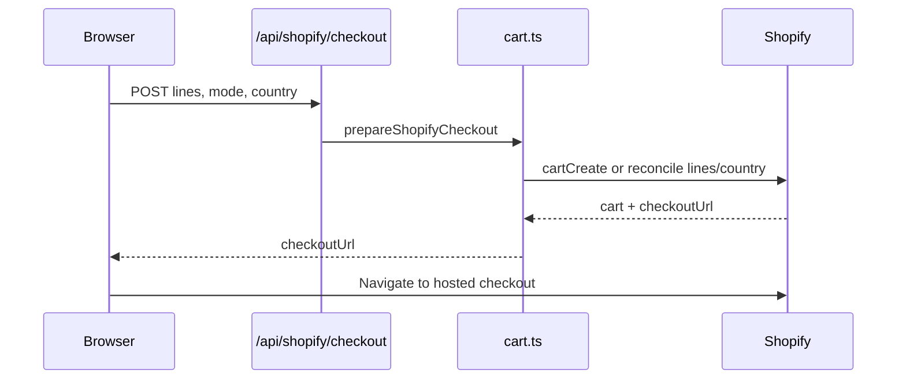
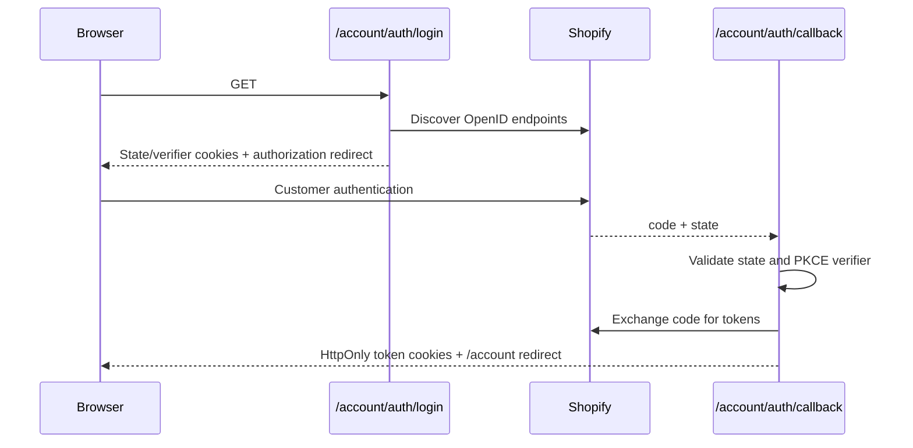

# Shopify integration

[Back to the project README](../../README.md) · [Shared domain logic](../README.md)

This folder owns server-side communication with Shopify. Product UI should consume mapped `CatalogProduct` values rather than raw Shopify GraphQL shapes.

## File map

| File | Responsibility |
| --- | --- |
| `config.ts` | Store domain/token resolution, API version, development fallback guard |
| `shopify.ts` | Typed Storefront GraphQL transport and safe operation-level errors |
| `client.ts` | Public exports for the Storefront client/config |
| `queries.ts` | Product, collection and search GraphQL documents |
| `types.ts` | Raw Shopify response types |
| `mapper.ts` | Converts Shopify products/variants/metafields into `CatalogProduct` |
| `cart.ts` | Shopify cart query/create/reconcile and checkout URL handling |
| `connection.ts` | Small connection diagnostic used by scripts |
| `customer-account.ts` | OpenID/Customer API discovery and customer summary query |
| `customer-account-url.ts` | Validates the hosted customer account fallback URL |
| `customer-wishlist.ts` | Reads/writes `custom.wishlist` with compare-digest protection |
| `shop-information.ts` | Reads Shopify-published contact, privacy, shipping, refund and terms fields with an unavailable fallback |

All modules that read environment variables, cookies, filesystem/server APIs, or access tokens are server-only by architecture. Do not import them into client components.

## Environment and Storefront API

`config.ts` builds:

```text
https://<SHOPIFY_STORE_DOMAIN>/api/2026-07/graphql.json
```

The preferred variables are `SHOPIFY_STORE_DOMAIN` and `SHOPIFY_STOREFRONT_ACCESS_TOKEN`. Legacy `VTBSJMYH_SHOPIFY_*` alternatives remain supported. Production never permits local catalog fallback; development only does so when `ENABLE_LOCAL_CATALOG_FALLBACK=true`.

`SHOPIFY_CUSTOMER_ACCOUNT_CLIENT_ID` enables custom Customer Account OAuth when the store domain is also present. `SHOPIFY_CUSTOMER_ACCOUNT_URL` is an optional validated HTTPS destination for hosted orders, addresses, profile and fallback sign-in. Newsletter webhook variables belong to `/api/newsletter`, not this Shopify module. All variables are documented without values in the [root environment table](../../README.md#environment-variables).

`shopifyFetch` sends the Storefront token in `X-Shopify-Storefront-Access-Token`, detects the GraphQL operation name for diagnostics, and converts network, HTTP, GraphQL, and missing-data cases into server errors. Do not include the token or complete response payload in logs.

All current catalog operations use `cache: 'no-store'`. OpenID discovery uses an hourly Next.js revalidation.

## Storefront queries and country context

Product fields include descriptions, images, options, variants, price ranges, compare-at prices, availability, quantity, SKU, product type, tags, collection membership, and the `custom.fabric_and_fit`/`custom.care_instructions` metafields.

Product, collection and search operations use Shopify `@inContext(country:)`. Allowed country values are IN, US, CA, GB and AU; invalid values fall back to IN. The Shopify response currency code travels with the mapped product/variant and must not be converted again.

Current query ceilings:

- Catalog: 100 products
- Collection: 100 products
- Search: 48 products
- Product images: 10
- Product variants: 100
- Product collection memberships: 20
- Shopify cart lines read: 100

Add cursor pagination before the store can exceed these limits.

## Product mapping

`mapper.ts` is the only raw-Shopify-to-storefront adapter. It:

- Selects the first available variant, falling back to the first variant.
- Carries variant IDs, options, prices, currency, availability, SKU, and image.
- Resolves colours/sizes from Shopify options, with colour-tag support as a fallback.
- Resolves a primary category from recognized collection handles, then product type.
- Marks New Arrival/Best Seller state from collection membership/tags.
- Flattens supported rich-text metafield JSON to display text.

Extend `queries.ts`, `types.ts`, `mapper.ts`, and `types/commerce.ts` in one change when adding fields.

## Cart and checkout



For normal checkout, `cart.ts` uses the HttpOnly `shopifyCartId` and `shopifyCartFingerprint` cookies. The fingerprint avoids rewriting a cart whose lines and country have not changed. Otherwise it updates buyer country, removes existing Shopify lines, and adds the current local lines. Cookies use same-site `lax`, root path, 30-day expiry, and `secure` in production.

Buy Now creates a fresh cart and does not replace the persisted normal cart. Each submitted merchandise ID must be a Shopify ProductVariant GID. The route returns only a verified Shopify `checkoutUrl` or a safe error.

Do not manually construct checkout URLs, bypass variant validation, accept client price totals as authoritative, or expose the Shopify cart ID to unrelated client code.

## Customer login



The login route requests `openid email customer-account-api:full` and uses SHA-256 PKCE. The callback URL is derived from the request origin. OAuth state and verifier cookies expire after 10 minutes.

The callback stores access/ID tokens in HttpOnly, same-site cookies scoped to `/account`, with secure cookies on HTTPS. Logout clears every account cookie and, when an ID token exists, redirects through Shopify's end-session endpoint back to `/account`.

`getCustomerAccountState()` returns an explicit union: unconfigured, unauthenticated, error, or authenticated. It retrieves display name/email and only whether at least one address/order exists. Full management remains hosted by Shopify.

There is no refresh-token storage or refresh flow. Do not document the session as permanent.

Shopify must approve the exact storefront JavaScript origin, `/account/auth/callback` redirect URI and `/account` post-logout URI for each deployment. The login route derives callback/logout URLs from the incoming origin; the callback sends that origin in token exchange. Verify proxy and custom-domain behavior before launch.

## Wishlist metafield

Required Shopify definition:

| Property | Value |
| --- | --- |
| Owner | Customer |
| Namespace | `custom` |
| Key | `wishlist` |
| Type | JSON |
| Customer Account API | Read and write |

```mermaid
flowchart LR
    A[Anonymous localStorage] -->|sign in| M[Merge and deduplicate]
    R[Remote custom.wishlist] --> M
    M --> API[/account/api/wishlist]
    API --> MF[Customer metafield]
    MF --> D[Other authenticated devices]
```

`readCustomerWishlist` obtains the customer owner ID, JSON value, and `compareDigest`. `writeCustomerWishlist` rereads the latest digest and calls `metafieldsSet`. Stale-object/digest errors become HTTP 409 through the route; other upstream failures become safe 5xx responses. Inputs are trimmed, deduplicated, limited to 255 characters each, and capped at 250 identifiers.

The browser merge, optimistic queue, multi-tab messaging, and logout isolation live in `context/StoreProvider.tsx`. Customer access tokens never leave the server endpoint.

## Published policies and account handoff

`shop-information.ts` queries Shopify's published contact information, privacy policy, shipping policy, refund policy, terms of service and terms of sale. It returns `null` when Storefront configuration is absent or the query fails; support/legal pages then show a notice rather than invented text. `PublishedPolicy` converts available HTML to text and links only to HTTPS original policy URLs. Privacy/terms/shipping pages control indexing based on whether the relevant published body is present. Merchant publication and final legal review remain external requirements.

The custom `/account` page fetches a customer summary only. `/account/orders`, `/account/addresses` and `/account/profile` redirect to the hosted account URL when configured or use the login fallback. Do not treat dormant local account editors as Shopify-backed management.

## Error handling and security rules

- Keep catalog failures distinct from missing/unpublished collections.
- Return safe customer-facing errors; log only operation/state metadata needed to diagnose.
- Customer responses must remain `private, no-store`.
- Never expose Customer access/ID tokens, Storefront tokens, Admin tokens, cookie contents, or customer data.
- Do not add Shopify Admin API access to storefront routes without a separate threat/permissions review.
- Preserve OAuth state validation, PKCE, HttpOnly cookies, origin-derived redirects, and HTTPS-only hosted account validation.
- Treat API-version upgrades as tested migrations; revalidate query fields and mutation inputs before changing `2026-07`.

## Common tasks

- **Add a product field:** update query, raw type, mapper, shared commerce type, then product/card UI.
- **Add a market:** extend the `Country` union/provider list and Shopify country allowlists in both catalog and cart paths.
- **Add a collection:** publish it in Shopify, add its canonical definition, and update intentional navigation/editorial surfaces.
- **Diagnose access:** run `npm run test:shopify`, then `npm run audit:shopify` against a non-production credential set.
- **Change account domain:** update Shopify-approved origins/callback/logout URLs and deployment variables together.
